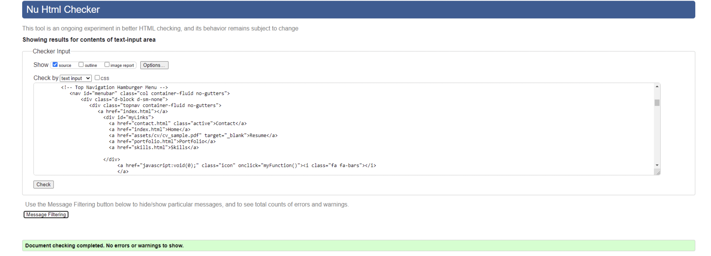

# Testing #

- All the features of this project have been manually tested  in order to make sure that  they respond effectively. Therefore, users can move from page to page since all of them are interconnected. 

- In the case of the ** Resume feature **. The document is open in a different window, giving the user the chance to download the document in a pdf format. 

 - Contact form:
When filling the form if the information required in the contact form is not correct (wrong email format, or not filling the text boxes.) an error message about the required fields will appear. 

As part of the testing process this website was tested using:
 - [W3C Markup Validator](https://validator.w3.org/) 
 - [Jigsaw W3C CSS Validator](https://jigsaw.w3.org/css-validator/)

- To achive the correct validation through these validator some modifications were made. such as:
   - The hamburger menu had to be replaced since the one originally used was not compatible. 
   - the buttons menu had to be also restructured since "a" elements can not be child of buttons. 
## W3C Markup Validator

- ## Home page ##

- ## Contact page ##

- ## Portfolio page ##

 
- ## Skills page ## 

 

## W3C CSS Validator

 This web has been tested in the following browsers:

 - [Mozila fire fox](https://www.mozilla.org/en-US/firefox/new/)
 - [Opera](https://www.opera.com/)
 - [Chrome](https://www.google.com/chrome/)
 - [windows Explorer](https://www.microsoft.com/en-us/edge).

 ## Responsiveness ##

This website is responsive. Consequently, it has been developed as to  be displayed in any device. 
The main changes users can evidence when accessing the site in a different device are:
In devices up to 576px buttons are used as the menu. Except for the portfolio page where there is a dropdown menu since this page is quite long. 
In devices with more than 576px  all pages have a top fixed navigation bar. 

In the portfolio-page pictures are displayed in two columns except in devices with less than 576px where just one column is displayed. 

## Bugs ##
I have some problems with the navigation bar. I  tried doing it myself but when i got to make the dropdown menu work, it did not work. finally made the menudrop work. It needed to  add the query link from boostrap to the header.

- After having fixed the problem mention above i came across with another problem related to the drop menu, When validating in the W3C Markup Validator site. This time the validator showed an error related to the use of buttons inside the 'a' Element which made me change the whole menu since. according to the validator this

- In order to pass the validator i also had to replace some "sections" for "divs" since the validator indicated that those sections were missing a header. 

- When trying to add a description to the images from the gallery i could not add a layer to the element "img" therefore i decided to omit this feature. 

-

 ## As recruiter I want to: ##
Have access to examples of projects that the developer has built in order to see what his capabilities as developer are.
   - When the recruiter or client clicks on **Portfolio** is brought to a gallery of images with examples of the works the developer has built or made part of. 
   
 Interact with the examples given to see how the websites respond to my needs. 
 - All the images from the gallery are linked to the websites so as to interact direclty with them. 

 - In the Skills page the user can also find  a data graphic in percentages that helps the user to have an idea of the developer's abilities regarding the different technologies he knows. 

Have direct **contact** with the developer either to ask about some specific features of his work or to offer him a job opportunity. 
-  In the **contact** page there is a text-box where users can sent a direct message to the developer. Also, the telephone number and email are attached to this page as to facilitate the direct interaction between the recruiter and the developer. 

Reach the developer through his social media channels.
- In the footer the user can find the all the links to the social media of the web developer 
   - [Faceook](https://www.facebook.com/)
   - [Instagram](https://www.instagram.com/)
   - [Twitter](https://www.twitter.com/)
   - [Github](https://www.github.com/)
   - [Linkedin](https://www.linkedin.com/)
